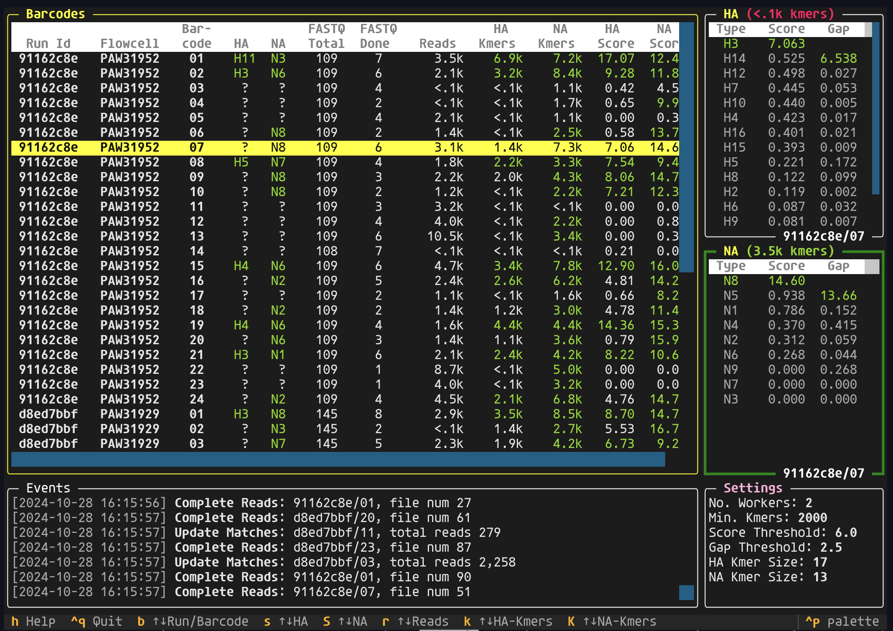

# Flui 🦆🦠🧬

A text-based user interface for sub-typing avian influenza viruses using real-time [Nanopore][nanopore] reads.



## Installation

> :warning: If you want to *develop*, rather than simply run `flui`, then see the section below for additional installation instructions.

### 1. Ensure you have access to the `flui` package

The software is hosted on a private GitHub repo.
You will need access rights to this repository to get the software.

The simplest way to get access to the package is by downloading a zip file from the [releases page](https://github.com/dragonfly-science/flui/releases).
You can also forward the zipfile to others who don't have access.

Alternatively, you can install the package directly from GitHub.
You will need to generate an SSH key that you have uploaded to GitHub.
See instructions [here](https://docs.github.com/en/authentication/connecting-to-github-with-ssh).

### 2. Install UV

`flui` is a python package.
There are many ways to install python packages, and most of them are complex.
[uv][uv] is a tool that simplifies the installation of python packages, and it is the recommended way to install `flui`.

Installation on MacOS and Unix:

```sh
curl -LsSf https://astral.sh/uv/install.sh | sh
```

For Windows:

```powershell
powershell -ExecutionPolicy ByPass -c "irm https://astral.sh/uv/install.ps1 | iex"
```

### 3. Install the package using UV

> :warning: If you are operating behind a corporate firewall, you may need to add the `--native-tls` flag to the following commands.

From a downloaded zip-file release (where x.x.x is the version downloaded):

```sh
uv tool install --from /path/to/zipfile/flui-x.x.x.zip flui
```

Directly from Github:

```sh
uv tool install --from git+ssh://git@github.com/dragonfly-science/flui.git@main flui
```

You should now be able to run `flui --help`

## Usage

To see how to launch the UI, type `flui --help` into the terminal and press enter.
This will show the options available to you.
The two key things to provide are:

* `--run`: The path to a parent directory of the FastQ files. This should contain one or more runs, each containing multiple barcode sub-folders.
* `--ref`: This contains the reference genomes of HA and NA segments from different subtypes.

Typically, you will want to run a command like this:

```sh
flui --ref ref.fasta --run /path/to/fastq/files
```

### Test driving

If you want to test drive the app:

* Download the sample reference file [here][sample_ref] (created using the [NCBI virus data][ncbi]).
* Download sample FastQ from [this paper][sample_fastq].

Once you have downloaded these you should unzip the FastQ downloads into a folder and then:

```sh
flui --ref reference-ncbi.fasta --run /folder/with/fastq
```

### Navigating the Application

Once you have started the application, you can navigate around using the arrow keys and tab keys.
Detailed help about all is available inside the `flui` application.
Simply press the “h” button after starting the application.
You can also read it here: [help](src/flui/help.md).

## Development

For development, you’ll need to install the following dependencies:

* [uv][uv]
* [just][just]

Once `uv` is installed, you can use it to install some additional tools:

```sh
uv tool install ruff
uv tool install pyright
```

The `just` tool is used to run development-related tasks.
The `check` command runs all linting and tests, for example:

```sh
just check
```

At this stage, generating releases is not automated.

[nanopore]: <https://nanoporetech.com/platform/technology>
[ncbi]: https://www.ncbi.nlm.nih.gov/labs/virus/vssi/#/virus?SeqType_s=Nucleotide
[sample_ref]: https://github.com/dragonfly-science/flui/blob/main/sample/reference-ncbi.fasta
[sample_fastq]: https://www.sciencebase.gov/catalog/item/638a4df0d34ed907bf7907ea
[uv]: https://docs.astral.sh/uv/
[just]: https://github.com/casey/just
